# Robot Data Forge

Robot Data Forge is a robot data trust layer for turning raw robot-action
trajectories into replay-verified, action-labelled, task-validated,
trainer-loadable dataset artifacts with reproducible provenance and curation
evidence.

> Portfolio position: robotics data pipeline, evaluator/curation system,
> dataset artifact engineering, and buyer-facing trust records.

It is not a VLA, World Foundation Model, RL framework, robot policy benchmark,
or HMD product. RDF is data infrastructure: it records raw trajectory evidence,
validates task state and data quality, gates replay/action contracts, curates
accepted/rejected examples, exports HDF5 datasets, writes buyer-facing trust
records, and checks that a trainer can load the result.

## Why This Problem

In robot learning, storing raw teleoperation trajectories is not enough to know
whether the data is usable for training. Task outcome, task state, action
contract, replayability, rejected reasons, exportability, trainer loader
compatibility, and limitations need to be recorded separately.

Robot Data Forge treats this as a verifiable data contract problem, not only a
collection app problem. MVP-1 does not claim policy uplift. It proves that a
trajectory can move through evaluator and curation gates into HDF5 dataset
artifacts, dataset cards, and reproducible trust records.

## MVP-1 Status

MVP-1 is complete as a **learning-ready dataset pipeline proof**. The current
reset proof is a **HMD-free data trust layer proof**; HMD/OpenXR collection is
preserved as an experimental input adapter, not the primary product identity.

What MVP-1 proves:

- raw robot-action trajectories can be stored with source/runtime metadata
- peg-in-hole task state can be extracted from recorded frames
- task outcome is recorded separately from data quality
- operator success is separated from evaluator task success
- replay/action contract evidence is recorded before training eligibility
- accepted/rejected curation reasons are written to manifests
- transition coverage is tracked in addition to episode-level outcome
- HDF5/export artifacts are generated
- trainer loader smoke checks pass
- dataset cards, proof reports, and trust records are generated

What MVP-1 does **not** claim:

- curated data improves held-out policy success rate
- RDF has trained a production robot policy
- RDF is a VLA/WFM system
- current artifacts are customer-grade policy-uplift proof

Policy uplift and downstream learning performance are MVP-2 work.

## Method

```mermaid
flowchart LR
    A[Input adapters] --> B[Normalized trajectory contract]
    B --> C[Source provenance]
    C --> D[Task state extraction]
    D --> E[Outcome + quality evaluator]
    E --> F[Replay / action contract gate]
    F --> G[Curation manifest]
    G --> H[HDF5 export]
    H --> I[Dataset card + trust record]
    I --> J[Trainer loader smoke]
```



Input adapters can include HMD/XR teleoperation, desktop teleoperation,
gamepad/SpaceMouse control, simulator replay, scripted policies, existing logs
or datasets, hosted robot workcells, and human curation. Each adapter should
emit the normalized trajectory contract; the trust layer should not depend on
one fragile runtime chain.

## What I Built

- HMD-free data trust layer proof path
- FastAPI backend and trajectory/task schema
- task state extraction, evaluator, and curation manifest
- accepted/rejected trajectory reason tracking
- HDF5 dataset export and dataset card generation
- trainer loader smoke check
- reproducible trust records and proof reports
- experimental Quest/OpenXR/Isaac Lab teleoperation adapter path
- buyer/developer documentation portal

## My Role

I designed the FastAPI backend, trajectory schema, evaluator, curation/export
pipeline, proof reports, and trust-layer reset. I separated "learning-ready
dataset artifact" from "learning-proven policy uplift" so the public claim stays
inside the evidence this repository can reproduce.

## Engineering Decisions

| Decision | Alternatives Considered | Why | Tradeoff |
| --- | --- | --- | --- |
| MVP-1 as dataset-artifact proof | Claim policy performance immediately | The verifiable unit is the data contract, export, and loader smoke | Policy uplift remains MVP-2 |
| HMD as experimental adapter | Keep HMD/OpenXR as product identity | Physical Gate 0 showed input viability and runtime-chain risk | Less flashy first proof path |
| raw log plus curation manifest | Store every trajectory as equal value | accepted/rejected reasons make data quality explainable | manifest/schema maintenance cost |
| HDF5 + dataset card + trust record | Keep only API database records | Buyers and trainers need portable evidence artifacts | export/proof stage added |
| SQLite local API path | Start with cloud backend | MVP proof benefits from local reproducibility | collaboration/ops remain later work |

## AI-Assisted Engineering Record

AI was used as a review partner for comparing design options and documentation
structure. It was especially useful for challenging evaluator/curation criteria,
README proof framing, and the boundary between MVP-1 and MVP-2 claims.

AI-suggested policy-uplift wording was rejected. The repository currently proves
**dataset artifact readiness**; learning uplift requires a separate held-out
evaluation.

## Stack

| Area | Stack |
| --- | --- |
| Backend | FastAPI, SQLAlchemy, Pydantic, Alembic |
| Experimental robotics runtime | Quest 3, OpenXR, ALVR, SteamVR, Isaac Lab |
| Dataset artifact | HDF5, curation manifest, dataset card, trust record |
| Validation | pytest, ruff, compileall, proof audit scripts |
| Reporting | HTML proof reports, docs portal, MVP task specs |

## Repository Layout

```text
apps/api/       FastAPI backend, models, evaluator, curator, export services
apps/web/       Minimal dashboard/prototype frontend
packages/       Shared dataset and trajectory schemas
scripts/        Offline proof scripts, live smoke scripts, export/trainer checks
docs/           Buyer docs, developer docs, archived docs, experiment notes
index.html      Root documentation portal
```

Generated runtime data is intentionally not committed:

```text
storage/
*.sqlite
*.hdf5
*.log
output.txt
```

## Run

Install dependencies:

```bash
uv sync --group dev
```

Run tests and lightweight compile checks:

```bash
uv run pytest -q apps/api/tests
uv run python -m compileall -q apps/api/app apps/api/tests scripts
```

Start the local SQLite-backed API:

```bash
DATABASE_URL=sqlite:///./storage/local_api.sqlite \
STORAGE_ROOT=storage \
uv run uvicorn app.main:app --app-dir apps/api --reload
```

## Proof Commands

Data trust layer reset proof:

```bash
uv run python scripts/run_data_trust_layer_proof.py --clean --pretty
```

MVP-1 dataset pipeline proof audit:

```bash
uv run python scripts/run_mvp1_proof_audit.py --pretty
```

MVP-2 pre-A/B learning sanity:

```bash
uv run python scripts/run_mvp2_learning_sanity.py --pretty
```

## Validation Evidence

| Evidence | Meaning |
| --- | --- |
| Data trust proof | HMD-free fixture trajectories pass accepted/rejected trust-layer gates |
| Curation manifests | accepted/rejected reasons are tracked instead of silently keeping every trajectory |
| HDF5 artifacts | dataset output is shaped for trainer consumption |
| Trainer smoke | loader compatibility is checked before claiming learning readiness |
| Dataset card | artifact context and limitations are documented for review |
| Trust record | provenance, schema version, audit trail, commands, and limitations are reproducible |
| Scope discipline | policy uplift is moved to MVP-2 instead of claimed in MVP-1 |

## Reports

- [Documentation portal](index.html)
- [Buyer docs](docs/buyer/index.html)
- [Data trust layer reset summary](docs/buyer/data_trust_layer_reset.html)
- [Detailed MVP-1/MVP-2 report](docs/buyer/rdf_mvp1_mvp2_detailed_report_ko.html)
- [MVP-1 one-screen proof result](docs/buyer/mvp1_validated_dataset_pipeline_result.html)
- [MVP-2 learning-proven strategy](docs/buyer/mvp2_learning_proven_strategy_ko.html)
- [MVP-1 task spec](docs/developer/task_spec.md)
- [API spec](docs/developer/api_spec.md)
- [Data schema](docs/developer/data_schema.md)

The HTML reports are self-contained local reports. If hosted on GitHub Pages,
they can be used as the portfolio-facing visual summary.

## Experimental Input Adapters

Quest/OpenXR/HMD collection remains available as an experimental input adapter.
It is not required for the first data trust layer proof, and it must not be used
to claim Gate A readiness until physical Gate 0 passes.

The live path expects Quest 3, ALVR, SteamVR/OpenXR, Isaac Lab, and the local
RDF API:

```bash
RDF_RECORD=1 \
RDF_ISAAC_TASK=Isaac-Forge-PegInsert-Direct-v0 \
RDF_TASK_TYPE=peg_in_hole \
./scripts/run_live_rdf_smoke_test.sh --no-start-xr
```

Use `--no-start-xr` only when ALVR, SteamVR, and the Quest connection are
already prepared manually.

## Known Limits

- MVP-1 proves dataset readiness, not policy performance improvement.
- HMD/OpenXR physical Gate 0 did not pass consistently enough to resume Gate A
  collection.
- Raw trajectory logs, SQLite databases, HDF5 files, and local live artifacts
  are intentionally excluded from git.
- Public demo data should only be added after sanitization and license/privacy
  review.
- MVP-2 should add transition-rich data, trainer/policy capacity, and curated
  vs uncurated held-out A/B evidence.
