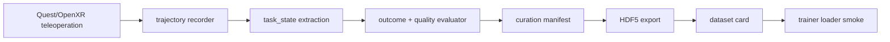

# Robot Data Forge

XR teleoperation trajectory를 replay-verified, action-labelled, task-validated, trainer-loadable dataset artifact로 변환하는 로봇 데이터 인프라 프로젝트입니다.

> Portfolio position: robotics data pipeline, evaluator/curation system, dataset artifact engineering.

## Why This Problem

로봇 학습에서 raw teleoperation trajectory만 저장하면 “학습에 쓸 수 있는 데이터인가?”를 판단하기 어렵습니다. 성공/실패, task state, action contract, replay 가능성, rejected reason, trainer loader smoke check가 분리되어 있으면 데이터는 많이 쌓여도 학습-ready artifact로 설명하기 어렵습니다.

Robot Data Forge는 이 문제를 “데이터 수집 앱”이 아니라 **검증 가능한 데이터 계약 시스템**으로 풀었습니다. MVP-1의 목표는 정책 성능 향상을 과장하는 것이 아니라, trajectory가 evaluator와 curation gate를 통과해 HDF5 dataset artifact와 dataset card로 닫히는지 증명하는 것입니다.

## Method



## What I Built

- Quest/OpenXR/Isaac Lab teleoperation trajectory recording path
- FastAPI backend and trajectory/task schema
- task state extraction, evaluator, and curation manifest
- accepted/rejected trajectory reason tracking
- HDF5 dataset export and dataset card generation
- trainer loader smoke check
- MVP-1 proof reports and MVP-2 learning-proof strategy docs

## My Role

FastAPI backend, trajectory schema, evaluator, curation/export pipeline, dataset proof reports를 설계했습니다. 정책 성능 향상 자체를 MVP-1 성과로 과장하지 않고, “학습 가능한 dataset artifact를 만들 수 있는가”를 검증 범위로 분리했습니다.

## Engineering Decisions

| Decision | Alternatives Considered | Why | Tradeoff |
| --- | --- | --- | --- |
| MVP-1을 dataset-artifact proof로 제한 | 바로 policy 성능 비교까지 주장 | 작은 공개 포트폴리오에서 가장 검증 가능한 단위는 데이터 계약과 loader smoke라고 판단 | 성능 향상 주장은 MVP-2로 남김 |
| raw log보다 curation manifest 중심 | 모든 trajectory를 같은 가치로 저장 | rejected reason이 있어야 데이터 품질을 설명하고 재현 가능하게 정리할 수 있음 | manifest/schema 관리 비용 증가 |
| HDF5 + dataset card export | API DB만 유지 | trainer가 읽을 수 있는 artifact와 사람이 읽을 수 있는 proof를 동시에 남김 | export 단계가 추가됨 |
| SQLite local API path 유지 | 초기부터 cloud backend | MVP 검증에는 local reproducibility가 더 중요 | 협업/운영 기능은 후순위 |

## AI-Assisted Engineering Record

AI는 설계 후보와 문서 구조를 빠르게 비교하는 검토 파트너로 사용했습니다. 특히 evaluator/curation 기준, README proof matrix, MVP-1과 MVP-2의 주장 경계가 섞이지 않도록 질문을 던지게 했고, 최종 공개 문구는 repo-visible docs, scripts, run commands로 확인 가능한 범위로 제한했습니다.

AI가 제안한 “정책 성능 향상”식 표현은 받아들이지 않았습니다. 이 저장소에서 현재 증명 가능한 것은 **dataset artifact readiness**이며, learning uplift는 별도의 held-out evaluation이 필요하다고 명시했습니다.

## Stack

| Area | Stack |
| --- | --- |
| Backend | FastAPI, SQLAlchemy, Pydantic, Alembic |
| Robotics runtime | Quest 3, OpenXR, ALVR, SteamVR, Isaac Lab |
| Dataset artifact | HDF5, curation manifest, dataset card |
| Validation | pytest, compileall, proof audit scripts |
| Reporting | HTML proof reports, MVP task specs |

## Run

```bash
uv sync --group dev
uv run pytest -q apps/api/tests
uv run python -m compileall -q apps/api/app apps/api/tests scripts
```

Start the local SQLite-backed API:

```bash
DATABASE_URL=sqlite:///./storage/local_api.sqlite \
STORAGE_ROOT=storage \
uv run uvicorn app.main:app --app-dir apps/api --reload
```

Run proof checks:

```bash
uv run python scripts/run_mvp1_proof_audit.py --pretty
uv run python scripts/run_mvp2_learning_sanity.py --pretty
```

## Validation Evidence

| Evidence | Meaning |
| --- | --- |
| MVP-1 pipeline proof | trajectory -> evaluator -> curation -> export path is documented as the proof target |
| Curation manifests | accepted/rejected reasons are tracked instead of silently keeping every trajectory |
| HDF5 artifacts | dataset output is shaped for trainer consumption |
| Trainer smoke | loader compatibility is checked before claiming learning readiness |
| Dataset card | artifact context and limitations are documented for review |
| Scope discipline | policy uplift is moved to MVP-2 instead of claimed in MVP-1 |

## Reports

- [Detailed MVP-1/MVP-2 report](docs/RDF_MVP1_MVP2_DETAILED_REPORT_KO.html)
- [MVP-1 one-screen proof result](docs/MVP1_VALIDATED_DATASET_PIPELINE_RESULT.html)
- [MVP-2 learning-proven strategy](docs/MVP2_LEARNING_PROVEN_PROOF_STRATEGY_KO.html)
- [MVP-1 task spec](docs/MVP1_TASK_SPEC.md)
- [API spec](docs/API_SPEC.md)
- [Data schema](docs/DATA_SCHEMA.md)

## Known Limits

- MVP-1 proves dataset readiness, not policy performance improvement.
- Raw trajectory logs, SQLite databases, HDF5 files, and local live artifacts are intentionally excluded from git.
- Public demo data should only be added after sanitization and license/privacy review.
- MVP-2 should add transition-rich data, trainer/policy capacity, and curated vs uncurated held-out A/B evidence.

## Status

MVP-1 is complete as a learning-ready dataset pipeline proof. MVP-2 is reserved for learning-effect proof, not retroactively claimed here.
